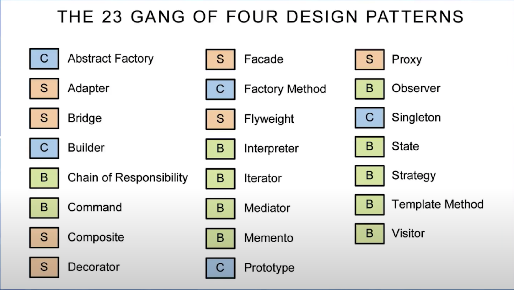

# Design Pattern

Les pa­trons de con­cep­tion sont des so­lu­tions clas­siques à des pro­blèmes ré­cur­rents de la con­cep­tion de lo­gi­ciels. Ce sont des sortes de plans ou de sché­mas que l’on peut per­son­na­li­ser afin de ré­soudre un pro­blème ré­cur­rent dans notre code.

Vous ne pou­vez pas vous con­ten­ter de trou­ver un pa­tron et de le re­co­pier dans votre pro­gramme comme vous le fe­riez avec des fonc­tions ou des li­brai­ries prêtes à l’em­ploi. Un pa­tron, ce n’est pas un bout de code spé­ci­fique, mais plu­tôt un con­cept gé­né­ral pour ré­soudre un pro­blème pré­cis. Vous pou­vez suivre le prin­cipe du pa­tron et im­plé­men­ter une so­lu­tion qui con­vient à votre propre programme.

Les pa­trons sont sou­vent con­fon­dus avec les al­go­rithmes, car ils dé­cri­vent tous deux des so­lu­tions clas­siques à des pro­blèmes con­nus. Un al­go­rithme dé­fi­nit tou­jours clai­re­ment un en­semble d’ac­tions qui va vous mener vers un ob­jec­tif, alors qu’un pa­tron, c’est la des­crip­tion d’une so­lu­tion à un plus haut ni­veau. Le code uti­lisé pour im­plé­men­ter un même pa­tron peut être com­plè­te­ment dif­fé­rent s’il est ap­pli­qué à deux pro­grammes distincts.

Un al­go­rithme c’est un peu comme une re­cette de cui­sine, ses étapes sont claires et vous gui­dent vers un ob­jec­tif pré­cis. Un pa­tron, c’est plu­tôt comme un plan : vous pou­vez voir ses fonc­tion­na­li­tés et les ré­sul­tats ob­te­nus, mais la ma­nière de l’im­plé­men­ter vous revient.

## Que trouve-t-on dans un pa­tron de con­cep­tion ?

La ma­jo­rité des pa­trons sont pré­sen­tés de façon très gé­né­rale, afin qu’ils soient re­pro­duc­tibles dans tous les con­textes. Voici les dif­fé­rentes sec­tions que vous re­trou­ve­rez ha­bi­tuel­le­ment dans la des­crip­tion d’un pa­tron :

* **L’In­ten­tion** du pa­tron per­met de dé­crire briè­ve­ment le pro­blème et la solution.

* **La Mo­ti­va­tion** ex­plique en dé­tail la pro­blé­ma­tique et la so­lu­tion of­ferte par le patron.

* **La Struc­ture** des classes montre les dif­fé­rentes par­ties du pa­tron et leurs relations.

* **L’Exemple de code** écrit dans un des lan­gages de pro­gram­ma­tion les plus po­pu­laires fa­ci­lite la com­pré­hen­sion gé­né­rale de l’idée der­rière le patron.

Vous re­trou­ve­rez toute une liste de dé­tails pra­tiques dans cer­tains ca­ta­logues de pa­trons : des cas d’uti­li­sa­tion, les étapes de l’im­plé­men­ta­tion et les liens avec d’autres patrons.

## Clas­si­fi­ca­tion des pa­trons de con­cep­tion

Les pa­trons de con­cep­tion peu­vent être ca­té­go­ri­sés selon leur in­ten­tion ou leur ob­jec­tif.

* Les **Pa­trons de créa­tion** four­nis­sent des mé­ca­nismes de créa­tion d’ob­jets, ce qui aug­mente la flexi­bi­lité et la réu­ti­li­sa­tion du code.

* Les **Pa­trons struc­tu­rels** ex­pli­quent com­ment as­sem­bler des ob­jets et des classes en de plus grandes struc­tures, tout en les gar­dant flexibles et efficaces.

* Les **Pa­trons com­por­te­men­taux** met­tent en place une com­mu­ni­ca­tion ef­fi­cace et ré­par­tis­sent les res­pon­sa­bi­li­tés entre les objets.

## Qui a in­venté les pa­trons de con­cep­tion ?

Les pa­trons de con­cep­tion sont des so­lu­tions clas­siques à des pro­blèmes con­nus en con­cep­tion orien­tée objet. 

Lorsqu’une ques­tion re­vient en­core et en­core dans dif­fé­rents pro­jets, quelqu’un se dé­cide fi­na­le­ment à dé­tail­ler la so­lu­tion et à lui don­ner un nom.

C’est sou­vent comme cela qu’un pa­tron est découvert.

Le con­cept de pa­tron de con­cep­tion a d’abord été dé­crit par Chris­to­pher Alexan­der dans *A Pat­tern Lan­guage: Towns, Buil­dings, Cons­truc­tion.
Le livre in­vente un « lan­gage » pour con­ce­voir un en­vi­ron­ne­ment ur­bain. Les uni­tés de ce lan­gage sont des pa­trons. Ils peu­vent in­di­quer la hau­teur at­ten­due des fe­nêtres, le nombre d’étages qu’un bâ­ti­ment de­vrait avoir, la taille des es­paces verts d’un quar­tier, etc.

Cette idée a été re­prise par quatre au­teurs : Erich Gamma, John Vlis­sides, Ralph John­son, et Ri­chard Helm. 
En 1994, ils ont pu­blié *De­sign Pat­terns : Ca­ta­logue de mo­dèles de con­cep­tion réu­ti­li­sables*, dans le­quel ils ont ap­pli­qué ce con­cept de pa­trons à la pro­gram­ma­tion. Le livre con­tient 23 pa­trons qui ré­sol­vent dif­fé­rents problèmes de con­cep­tion orien­tée objet et est très ra­pi­de­ment de­venu un best-sel­ler. 

Son nom était un peu trop long et au cours du temps, il a na­tu­rel­le­ment été rem­placé par « the book by the Gang of Four » (le livre du gang des quatre), puis en­core rac­courci en « the GoF book ».

Nous présentons les 23 patrons de conception ci-dessous les plus théorisés (Gof)

- Structural

- Creational

- Behavioral

