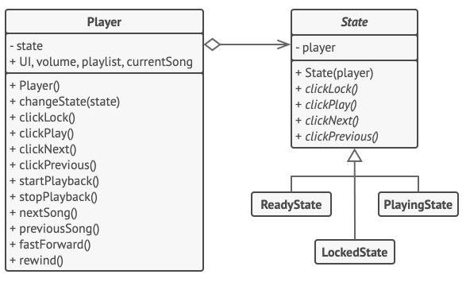

# Patrons Comportementaux
# State

**State** est un pa­tron de con­cep­tion com­por­te­men­tal qui per­met de mo­di­fier le com­por­te­ment d’un objet lorsque son état in­terne change. L’objet donne l’im­pres­sion qu’il change de classe.

Le prin­cipe re­pose sur le fait qu’un pro­gramme pos­sède un nombre fini d'états. Le pro­gramme se com­porte dif­fé­rem­ment selon son état et peut en chan­ger ins­tan­ta­né­ment.
En re­vanche, selon l’état dans le­quel il se trouve, cer­tains états ne lui sont pas ac­ces­sibles. Ces règles de chan­ge­ment d’état sont ap­pe­lées tran­si­tions. Elles sont éga­le­ment fi­nies et pré­dé­ter­mi­nées.

Vous pou­vez ap­pli­quer cette ap­proche aux ob­jets. 

Ima­gi­nons une classe ``Document``. Un do­cu­ment peut être dans l’un des trois états sui­vants : Brouillon (draft), Modération et Publié. La mé­thode ``publier`` du do­cu­ment fonc­tionne un peu dif­fé­rem­ment en fonc­tion de son état :

* Dans `Brouillon`, elle passe le do­cu­ment en modération.
* Dans `Modération`, elle rend le do­cu­ment pu­blic si l’uti­li­sa­teur ac­tuel est un ad­mi­nis­tra­teur.
* Dans `Publié`, elle ne fait rien du tout.


*Les états et tran­si­tions pos­sibles d’un objet document.*

On pourrait définir une classe `Document` et utiliser des opérateurs conditionnels (`if` ou `switch`) pour choisir le comportement approprié en fonction de l'état de l'objet. 

```php
class Document {
  private $state;
  public function publish() {
    switch($this->state) {
      case "draft":
        state = "moderation";
        break;
      case "moderation":
        if (currentUser.role == 'admin') state = "published";
        break;
      case "published":
        // Do Stuff
        break;
    }
  }
}
```

Lorsque l'on va utiliser de plus en plus d'états et de comportements à la classe `Document` nous allons avoir des difficultés pour la lire, la modifier et/ou la maintenir.

Le patron de conception **State** propose de créer de nouvelles classes pour tous les états possibles d'un objet et d'extraire les comportements liés aux états dans ces classes. 

L'objet original, nommé **contexte**, stocke une référence vers un des objets état qui représente son état actuel. 


*Do­cu­ment dé­lègue la tâche à un objet état.*

Les états ont de la vi­si­bi­lité entre eux et peu­vent lan­cer les tran­si­tions d’un état à l’autre.

Une analogie peut être faite avec votre smartphone qui fonctionne différemment selon l'état de l'appareil : 

* Si le té­lé­phone est dé­ver­rouillé, ap­puyer sur des bou­tons lance dif­fé­rentes fonc­tion­na­li­tés.
* Si le té­lé­phone est ver­rouillé, ap­puyer sur n’im­porte quel bou­ton en­voie sur l’écran de dé­ver­rouil­lage.
* Si la bat­te­rie du té­lé­phone est faible, ap­puyer sur n’im­porte quel bou­ton montre l’écran de charge.


1. Le **Con­texte** stocke une ré­fé­rence vers un des ob­jets con­crets État et lui dé­lègue toutes les tâches con­cer­nant les états. Il uti­lise l’in­ter­face état pour com­mu­ni­quer avec l’objet état. Il ex­pose un set­ter pour lui pas­ser un nou­vel état.

2. L’in­ter­face **État** dé­clare les mé­thodes spé­ci­fiques aux états. Ces mé­thodes doi­vent fonc­tion­ner avec tous les états con­crets : des mé­thodes inu­tiles qui ne sont ja­mais ap­pe­lées à l’in­té­rieur de vos états sont à proscrire.

3. Les **États Con­crets** ou **ConcreteStates** four­nis­sent leurs propres im­plé­men­ta­tions aux mé­thodes qui agis­sent sur les états. Pour évi­ter d’écrire le même code dans les dif­fé­rents états, vous pou­vez créer des classes abs­traites in­ter­mé­diaires qui en­cap­su­lent les com­por­te­ments identiques.

Les états peu­vent gar­der une ré­fé­rence vers le con­texte. Grâce à cette ré­fé­rence, l’état peut ré­cu­pé­rer des in­for­ma­tions de­puis le con­texte et lan­cer des transitions.

4. Le con­texte et les états con­crets peu­vent mo­di­fier le pro­chain état du con­texte et lan­cer une tran­si­tion en rem­pla­çant l’état lié au contexte.

## Exemple : Music Player

Dans cet exemple, le pa­tron de con­cep­tion State per­met aux touches du lec­teur mul­ti­mé­dia d’avoir un com­por­te­ment re­la­tif à l’état ac­tuel de la lecture.



L’objet prin­ci­pal du lec­teur est tou­jours as­so­cié à un objet état qui ef­fec­tue la ma­jeure par­tie du tra­vail pour le lec­teur. Cer­taines ac­tions rem­pla­cent l’état ac­tuel du lec­teur par un autre, mo­di­fiant sa ma­nière de réa­gir aux in­te­rac­tions de l’uti­li­sa­teur.

```php
class AudioPlayer {
  private State $state;
  private $ui, $volume, $playlist, $currentSong;

  // Le contexte délègue la gestion des interventions de
  // l’utilisateur à un objet état. Le résultat va
  // évidemment dépendre de l'état actuel, puisque chaque
  // état réagit différemment aux manipulations des
  // utilisateurs.
  __constructor() {
    $this->state = new ReadyState($this);
    $UI = new UserInterface()
    $UI->lockButton.onClick($this->clickLock)
    $UI->playButton.onClick($this->clickPlay)
    $UI->nextButton.onClick($this->clickNext)
    $UI->prevButton.onClick($this->clickPrevious)
  }

  // Les autres objets doivent pouvoir changer l'état du
  // lecteur audio.
  public function changeState(State $state) {
    $this->state = $state;
  }

  // Les méthodes de l’UI délèguent l’exécution à l'état
  // actuel.
  public function clickLock() {
    $this->state->clickLock();
  }
  public function clickPlay() {
    $this->state->clickPlay();
  }
  public function clickNext() {
    $this->state->clickNext();
  }
  public function clickPrevious() {
    $this->state->clickPrevious();
  }

  // Un état peut appeler les méthodes d’un service sur le
  // contexte.
  public function startPlayback() {
    // Do Stuff
  }
  public function stopPlayback() {
    // Do Stuff
  }
  public function nextSong() {
    // Do Stuff
  }
  public function previousSong() {
    // Do Stuff
  }
  public function fastForward($time) {
    // Do Stuff
  }
  public function rewind($time) {
    // Do Stuff
  }
}
```

```php
// La classe de base State déclare des méthodes que tous les
// états concrets doivent obligatoirement implémenter et fournit
// aussi une référence arrière vers l’objet du contexte associé
// à l’état. Les états peuvent utiliser cette référence arrière
// pour permuter l’état du contexte.

abstract class State {
  protected AudioPlayer $player;
  // Le contexte s’envoie lui-même au constructeur de l’état,
  // permettant de donner un coup de pouce à l'état pour
  // récupérer des données contextuelles si nécessaire.
  __construct($player) {
    $this->player = $player;
  }
  abstract public function clickLock();
  abstract public function clickPlay();
  abstract public function clickNext();
  abstract public function clickPrevious();
}
```

```php
// Les états concrets implémentent différents comportements
// associés à un état du contexte.
class LockedState extends State {
   // Lorsque vous déverrouillez un lecteur verrouillé, il peut
    // prendre l’un des deux états.
    public function clickLock() {
       if ($this->player->playing) {
        $this->player->changeState(new PlayingState($this->player));
       }
       else {
        $this->player->changeState(new ReadyState($this->player));
       }
    }

    public function clickPlay() {
      // Verrouillé, ne rien faire.
    }

    public function clickNext() {
      // Verrouillé, ne rien faire.
    }

    public function clickPrevious() {
      // Verrouillé, ne rien faire.
    }
}
```

```php
// Ils peuvent également déclencher les transitions de l’état
// dans le contexte.
class  ReadyState extends State {
  public function clickLock() {
    $this->player->changeState(new LockedState($this->player));
  }

  public function clickPlay() {
    $this->player->startPlayback();
    $this->player->changeState(new PlayingState($this->player));
  }

  public function clickNext() {
    $this->player->nextSong();
  }

  public function clickPrevious() {
    $this->player->previousSong();
  }
}
```

```php
class PlayingState extends State {
  public function clickLock() {
    $this->player->changeState(new LockedState($this->player));
  }

  public function clickPlay() {
    $this->player->startPlayback();
    $this->player->changeState(new ReadyState($this->player));
  }

  public function clickNext() {
    if($doubleClicked) {
      $this->player->nextSong();
    }
    else {
      $this->player->fastForward(5);
    }
  }

 public function clickPrevious() {
    if($doubleClicked) {
      $this->player->previous();
    }
    else {
      $this->player->rewind(5);
    }
  }
}
```

* Uti­li­sez le pa­tron de con­cep­tion State lorsque le com­por­te­ment de l’un de vos ob­jets varie en fonc­tion de son état, qu’il y a beau­coup d’états dif­fé­rents et que ce code change souvent.

* Uti­li­sez ce pa­tron si l’une de vos classes est pol­luée par d’énormes blocs con­di­tion­nels qui mo­di­fient le com­por­te­ment de la classe en fonc­tion de la va­leur de ses attributs.

* Uti­li­sez ce pa­tron de con­cep­tion si vous avez trop de code du­pli­qué dans des états et tran­si­tions si­mi­laires de votre automate.


## **{CHALLENGE}** Exercice 1 : Street Fighters

Dans le dossier `Sources` se trouve une application de base d'un jeu de combat : **STREET FIGHTERS STATES**.

Récupérez les fichiers sources. 

Il va falloir implémenter le **design Pattern STATE** dans ce projet et compléter les état : `KO`, `Healthy` et `Rage` selon les instructions laissées en commentaire dans le code. 