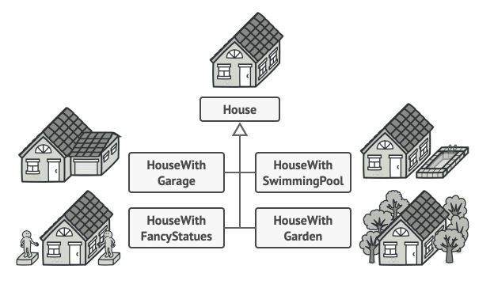
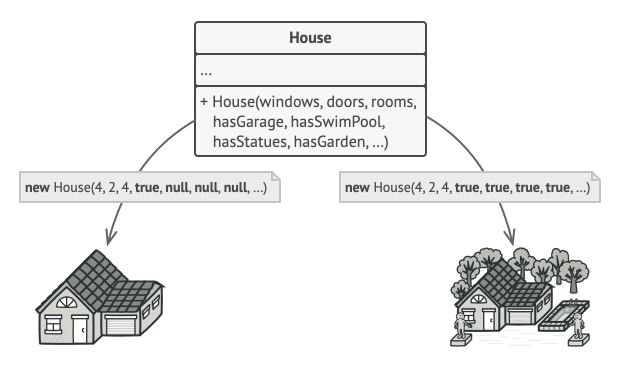
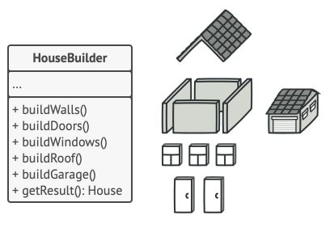
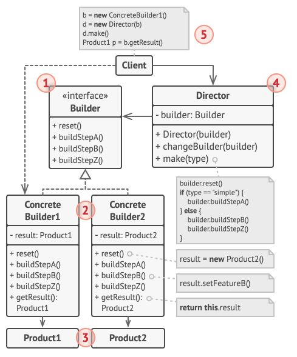
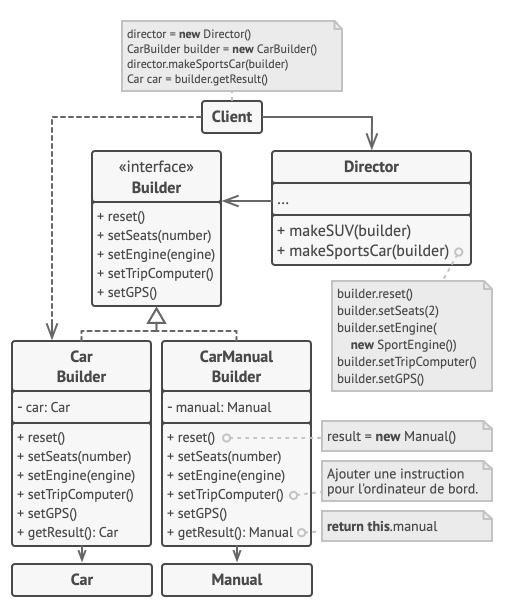

# Patrons de création

# Builder

**Builder** est un pa­tron de con­cep­tion de créa­tion qui per­met de cons­truire des ob­jets com­plexes étape par étape. Il per­met de pro­duire dif­fé­rentes va­ria­tions ou re­pré­sen­ta­tions d’un objet en uti­li­sant le même code de construction.

Ima­gi­nez un objet com­plexe qui né­ces­site une ini­tia­li­sa­tion fas­ti­dieuse, com­po­sée de plu­sieurs par­ties avec de nom­breux champs et ob­jets im­bri­qués. Le code d’ini­tia­li­sa­tion va se re­trou­ver dans un cons­truc­teur, en­terré sous une pile mons­trueuse de pa­ra­mètres, ou en­core pire : ré­parti un peu par­tout dans le code client.



*Créer une sous-classe pour chaque con­fi­gu­ra­tion pos­sible d’un objet risque de rendre le pro­gramme trop complexe.*

Pour fa­bri­quer une mai­son de base, vous devez cons­truire quatre murs et un sol, ins­tal­ler une porte, poser quelques fe­nêtres et bâtir un toit.

Mais com­ment pro­cé­der si vous vou­lez une plus grande mai­son avec plus de lu­mière, un peu de ter­rain et autres com­mo­di­tés (un sys­tème de chauf­fage, de la plom­be­rie et des câbles élec­triques) ?

La so­lu­tion la plus simple est d’étendre la classe de base `House` et de créer un en­semble de sous-classes pour cou­vrir toutes les com­bi­nai­sons de pa­ra­mètres.

Mais au bout d’un cer­tain temps, vous allez vous re­trou­ver avec un nombre con­si­dé­rable de sous-classes. 

Le moindre pa­ra­mètre sup­plé­men­taire comme le style du porche par exemple, va en­core plus dé­ve­lop­per la hiérarchie.

Voici une autre ap­proche qui n’im­plique pas de gé­né­rer des sous-classes : vous pou­vez créer un cons­truc­teur géant dans la classe de base `House` avec tous les pa­ra­mètres con­trô­lant l’objet mai­son. Cette so­lu­tion éli­mine le be­soin de sous-classes, mais en­traîne un autre problème.



*Un cons­truc­teur qui pos­sède de nom­breux pa­ra­mètres a ses in­con­vé­nients : ces der­niers ne sont pas tou­jours tous utilisés.*

Dans la ma­jo­rité des cas, la plu­part des pa­ra­mètres res­te­ront inu­ti­li­sés, ren­dant l'appel au constructeur fastidieux. Par exemple, le pa­ra­mètre re­cen­sant les pis­cines se ré­vèle inu­tile neuf fois sur dix, car peu de mai­sons en sont équipées.

## Solution

Le pa­tron de con­cep­tion **builder** pro­pose d’ex­traire le code du cons­truc­teur d’objet de sa classe et de le dé­pla­cer dans des ob­jets dis­tincts ap­pe­lés **builders**.



*Le pa­tron de con­cep­tion *builder* per­met de cons­truire des ob­jets com­plexes étape par étape. Le *builder* em­pêche les autres ob­jets d’ac­cé­der au pro­duit pen­dant sa construction.*

Il or­ga­nise la cons­truc­tion de l’objet à l’aide d’une série d’étapes (`buildWalls()`, `buildDoors()`, etc.). Pour créer un objet, vous allez ef­fec­tuer une sé­quence d’étapes dans un objet builder. 

Le gros avan­tage, c’est que vous n’avez pas be­soin d’ap­pe­ler toutes les étapes, mais seule­ment celles né­ces­saires à la créa­tion de la con­fi­gu­ra­tion par­ti­cu­lière d’un objet.

## Director

Vous pou­vez aller en­core plus loin en pre­nant tous les ap­pels aux étapes uti­li­sées pour cons­truire un pro­duit, et en les met­tant dans une classe sé­pa­rée que l’on nomme **Director**. 

La classe **Director** va dé­fi­nir l’ordre d’exé­cu­tion des dif­fé­rentes étapes et le **builder** four­nit les im­plé­men­ta­tions de ces étapes.

La classe **Director** n’est pas obli­ga­toire.Ce­pen­dant, elle se ré­vèle idéale pour y pla­cer les rou­tines de cons­truc­tion et pou­voir les réu­ti­li­ser en­suite dans votre programme.

## Structure



1. L’in­ter­face du **Builder** dé­clare les étapes com­munes de la cons­truc­tion du pro­duit entre tous les Builders.

2. Les **Builders** Con­crets four­nis­sent dif­fé­rentes im­plé­men­ta­tions des étapes de la cons­truc­tion. Ils peu­vent créer des pro­duits qui ne re­pren­nent pas l’in­ter­face commune.

3. Les **Products** sont les ré­sul­tats re­tour­nés. Les pro­duits cons­truits par les dif­fé­rents builders ne sont pas obli­gés d’ap­par­te­nir à la même hié­rar­chie de classes ni d’avoir la même interface.

4. Le **Director** in­dique l’or­don­nan­ce­ment des étapes de cons­truc­tion et offre la pos­si­bi­lité de créer et de réu­ti­li­ser des con­fi­gu­ra­tions spé­ci­fiques pour les produits.

5. Le **Client** doit as­so­cier l’un des **builders** au **director**. En gé­né­ral cette as­so­cia­tion n’est réa­li­sée qu’une seule fois, grâce aux pa­ra­mètres du cons­truc­teur du **director**. Pour toute cons­truc­tion ul­té­rieure, le director uti­lise l’objet builder. En guise d’al­ter­na­tive, le client peut pas­ser l’objet builder à la mé­thode de pro­duc­tion du director. Dans ce cas, vous pou­vez uti­li­ser un builder dif­fé­rent chaque fois que vous lan­cez une pro­duc­tion avec le director.

## Mise en pratique

Nous allons mettre en place le code d'un Builder pour assembler différents modèles de voitures et leur manuels. 



L’utilisation du patron de conception monteur n’est conseillée que si vos produits sont complexes et nécessitent une configuration étendue. Bien qu’ils n’aient pas la même interface, les deux produits suivants sont liés.

```php
class Car {
  // Une voiture est équipée d’un GPS, d’un ordinateur de bord
  // et d'un certain nombre de sièges. Les différents modèles
  // de voitures (sport, SUV, cabriolet) ont différentes
  // fonctionnalités installées ou activées.
}
```

```php
class Manuel {
  // Chaque voiture doit avoir un manuel d’utilisation qui
  // correspond à sa configuration et décrit toutes ses
  // fonctionnalités.
}
```

```php
// L’interface du Builder contient des méthodes spécialisées
// pour créer les différentes parties des objets du produit.
interface Builder {
  public function reset()
  public function setSeats()
  public function setEngine()
  public function setTripComputer()
  public function setGPS()
}
```

```php
// Les classes Builder suivent l’interface Builder
// et procurent des implémentations spécifiques pour les étapes
// de la fabrication. Votre programme peut contenir plusieurs
// variantes de Builders, chacune avec sa propre implémentation.
class CarBuilder implements Builder {
  private Car $car;

  __construct() {
    $this->reset();
  }

  public function reset() {
    $this->car = new Car();
  }

  public function setSeats() { /* Do Stuff */ }
  public function setSeats() { /* Do Stuff */ }
  public function setEngine() { /* Do Stuff */ }
  public function setTripComputer() { /* Do Stuff */ }
  public function setGPS() { /* Do Stuff */ }

  public function getProduct() {
    $product = $this->car;
    $this.reset();
    return $product;
  }
}
```

```php
class CarManualBuilder implements Builder {
  private Manual $manual;

  __constructor() {
    $this->reset();
  }

  public function reset() {
    $this->manual = new Manual();
  }

  public function setSeats() {/* Fonctionnalités des sièges dans le manuel. */}
    

  public function setEngine() {/* Ajoute les informations concernant le moteur. */}

  public function setTripComputer() {/* Ajoute les instructions concernant l’ordinateur de bord*/}

  public function setGPS() {/* Ajoute les instructions concernant le GPS. */}

  public function getProduct()
    $manual = $this->manual;
    $this.reset();
    return $manual;
}
```

```php
class Director {
  private Builder $builder;

  public function setBuilder(Builder $builder) {
    $this->builder = $builder
  }

  public SportCar(Builder $builder) {
    $builder->reset()
    $builder->setSeats(2)
    $builder->setEngine(new SportEngine())
    $builder->setTripComputer(true)
    $builder->setGPS(true)
  }

  public SUVCar(Builder $builder) {
    $builder->reset()
    $builder->setSeats(5)
    $builder->setEngine(new SUVEngine())
    $builder->setTripComputer(true)
    $builder->setGPS(true)
  }

  public MonoSpaceCar(Builder $builder) {
    $builder->reset()
    $builder->setSeats(8)
    $builder->setEngine(new MonoEngine())
    $builder->setTripComputer(true)
    $builder->setGPS(true)
  }
}
```

* Application
```php
 $director = new Director();
 $builder = new CarBuilder()
 $director->SportCar($builder);
 $car = $builder->getProduct();

 $builder = new CarManualBuilder();
 $director->SportCar($builder);
 $manual = $builder->getProduct();
```

# **{CHALLENGE}** Exercice Builder : IceCream

Vous mettrez en place une application qui permet de créer des glaces à l'aide du Design Pattern **Builder**.
Implémenter également la méthode ``__toString()`` qui renvoie le nom de glace et son prix. 

La création de glace permet d'ajouter des options comme le parfum, ainsi que des suppléments caramel ou chocolat et le type de cornet.

L'ajout des options fait varier le prix de la glace. 

* Prix des cornets : 
  * Classic => 5 €
  * Gauffre => 6 €
  * Pot => 4 €
* Nombre de boule dans le cornet : 
  * 1 boule => 0 €
  * 2 boules => 2 €
  * 3 boules => 4 €
  * 4 boules => 6 €
* Suppléments : 
  * Chocolat => 2 €
  * Fraise => 2 €
  * Framboise => 2 €
  * Caramel => 2 €
  * Noix => 3 €
  * Speculos => 3 €


