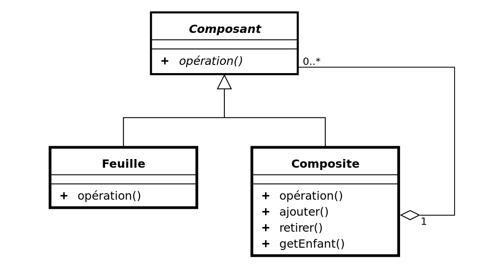

# Composite

## Intéret

Composite est un patron de conception structurel.

Le composite est soit une feuille, soit un composite d'objets d'arboresents.

Par exemple, si vous avez à calculer le prix total de produits. Ces produits peuvent se trouver sous deux formes : un conteneur de produits ou le produit lui-même. Si on a un produit (feuille), alors on retournera son prix et si on a un conteneur de produits alors on parcours tous ses produits pour calculer le total des prix, si on re-tombe, lors du parcours, sur un sous-conteneur, on parcours les produits pour en faire également la somme, ainsi de suite... Le composite permet de s'adapter à une structure d'objets arborescents.




- Component

```php
abstract class Component
{
    abstract public function operation(): string;
}
```

- Leaf, elle est terminale, ici pour l'exemple disons que cette classe retourne une chaîne de caractères.

```php
class Leaf extends Component
{
    public function operation(): string
    {
        return "Leaf";
    }
}
```

- La classe composite

```php
class Composite extends Component
{
    
    public function __construct(){
        $this->children =  new \SplObjectStorage(); 
    }

    public function add(Component $c): void
    {
        $this->children->attach($c);
    }

    public function remove(Component $c): void
    {
       $this->children->detach($c);
    }

    // cette méthode est purement informative
    public function get(): \SplObjectStorage{

        return $this->children;
    }

    public function operation(): string
    {
        $results = [];
        foreach ($this->children as $child) {
            $results[] = $child->operation();
        }

        return "Branch(" . implode("+", $results) . ")";
    }
}
```

- Exemple

```php
$tree = new Composite();
$branch1 = new Composite();
$branch1->add(new Leaf());
$branch1->add(new Leaf());
$branch2 = new Composite();
$branch2->add(new Leaf());
$tree->add($branch1);
$tree->add($branch2);
echo "Composite tree:\n";
$tree->operation();
echo "\n\n";
```

## 01 Exercice Form

### Partie 1

On souhaite créer un formulaire à la voler. En utilisant le design pattern Composite créez un composant Form.

Vous devez créer des éléments Composites pour gérer, par exemple la balise form HTML qui contiendra les éléments simples (Leaves).

Créez également un Wrapper pour styliser les éléments du formulaire.

Par ailleurs, d'autres éléments comme les champs du formulaire eux-mêmes peuvent être considérer comme des éléments de type Leaf ou terminaux.

Vous testerez le bon fonctionnement de votre composant. Vous présenterez votre campagne de tests dans un fichier de type markdow.

Pour les tests vous pouvez par exemple : testez l'ajout de feuille ou d'élément de type Composite.

### Exemple d'utilisation

```php
$form = new Form(name : 'user', action : "/add");
$form->add(new Input('name', "Name", 'text'));
$form->add(new Input('description', "Description", 'text'));

$wrapper = new Wrapper(); // entoure avec un div
$wrapper->add(new Input('caption', "Caption", 'text'));
$wrapper->add(new Input('image', "Image", 'file'));

$form->add($wrapper);

echo $form . "\n";
```
