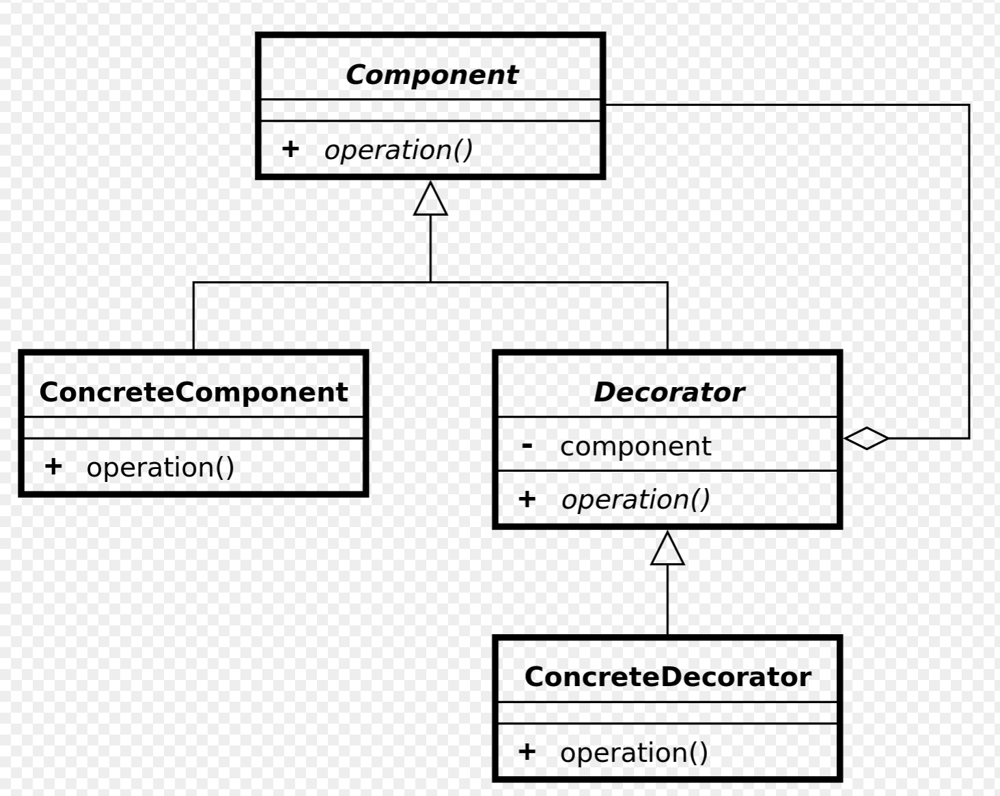

# Decorator

Il est également appelé emballeur ou empaqueteur.

Le décorateur possède le même ensemble de méthodes que la cible et lui délègue toutes les demandes qu'il reçoit.

Le diagramme UML de ce pattern est le suivant :



## 01 Exemple

```php
interface HtmlElement
{
    public function __toString();
    public function getName();
}
```

- Classe concrète

```php
class Input implements HtmlElement
{
    public function __construct(protected string $name, protected string $type)
    {
    }

    public function getName()
    {
        return $this->name;
    }

    public function __toString()
    {
        return "<input type=\"text\" id=\"{$this->name}\" name=\"{$this->name}\" />\n";
    }
}
```

- Decorateur abstrait

```php

abstract class HtmlDecorator implements HtmlElement
{
    public function __construct(protected HtmlElement $element)
    {
    }
    public function getName()
    {
        return $this->element->getName();
    }
}

class LabelDecorator extends HtmlDecorator
{
    protected $label;
    public function setLabel($label)
    {
        $this->label = $label;
    }
    public function __toString()
    {
        $name = $this->getName();
        return "<label for=\"{$name}\">{$this->label}"
            . $this->element->__toString()
            . "</label>\n";
    }
}

class ErrorDecorator extends HtmlDecorator
{
    protected $error;
    public function setError($message)
    {
        $this->error = $message;
    }
    public function __toString()
    {
        return $this->element->__toString() . "<span>{$this->error}</span>\n";
    }
}
```

On a une classe de base qui va être décorée :

```php
$input = new Input(name : 'nickname', type : 'text');
$label = new LabelDecorator($input);
$label->setLabel('Nickname:');
$error = new ErrorDecorator($label);
$error->setError('You must enter a unique nickname');
printf("%s\n", $error);
```

## 01 Exercice Html decorator

Soit un texte de base, que nous allons gérer dans une classe Text, Nous aimerions pouvoir mettre en forme ce texte à l'aide du design pattern Decorator comme suit :

```php
echo (new Paragraph((new Italic(new Text('hello world'))))); 
// <p><em>hello world</em></p>
```

Créez le composant qui permet d'obtenir ce résultat et testez-le.

Remarque pour tester une méthode __toString dans un test avec PHPUnit castez l'objet en question comme ci-après.

Le caste string exécutera la méthode __toString() si l'objet implémente cette méthode magique.

```php
(string) $contentText; 
``` 